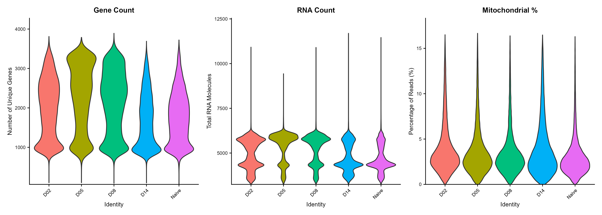
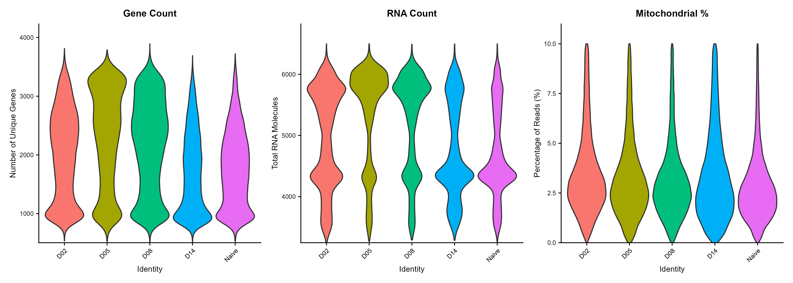
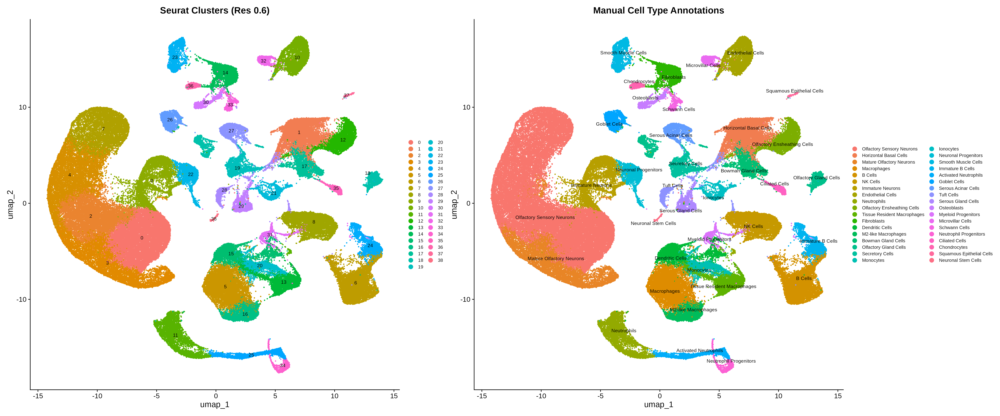
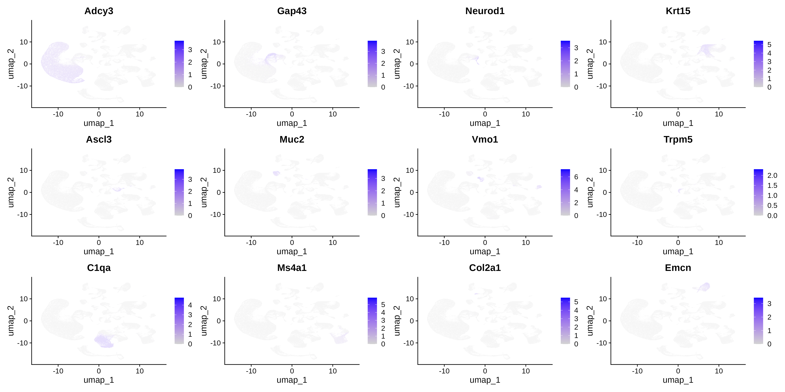
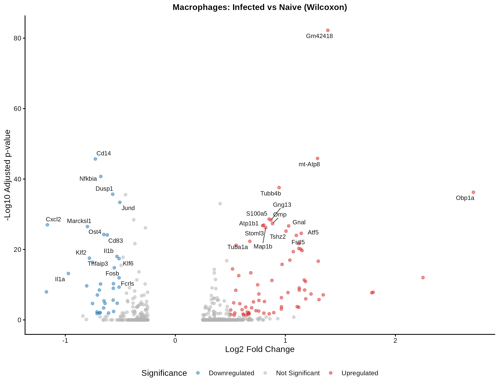
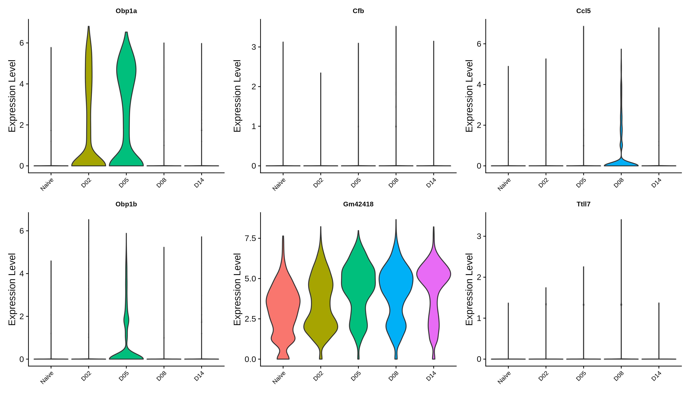
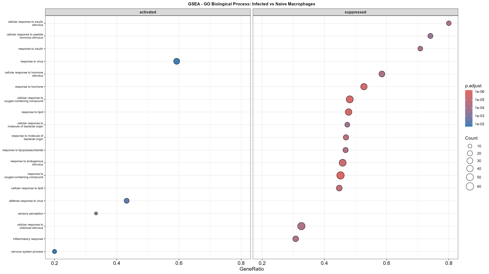

# Single-cell RNA Sequencing Analysis

## General Overview
This project explores how Influenza A virus (IAV) infection affects the nasal mucosa using single-cell RNA sequencing (scRNA-seq) data from a mouse model. Clustering, cell type annotation, and differential expression analysis are performed to identify how different cell populations respond to infection. The results show a shift from normal sensory function to a strong immune response, particularly in macrophages. Overall, this highlights the role of the nasal mucosa as a key barrier against viral infection.

## Table of Contents
- [Introduction](#introduction)
- [Methods](#methods)
  - [1. Data Description](#1-data-description)
  - [2. Quality Control](#2-quality-control)
  - [3. Normalization & Scaling](#3-normalization--scaling)
  - [4. Clustering](#4-clustering)
  - [5. Annotation](#5-annotation)
  - [6. Differential Expression](#6-differential-expression)
  - [7. GSEA](#7-gsea)
- [Results](#results)
- [Discussion](#discussion)
- [References](#references)

## Introduction
Influenza A virus (IAV) is a highly contagious respiratory pathogen that causes seasonal flu outbreaks, resulting in substantial global morbidity and mortality. IAV infections are responsible for hundreds of thousands of respiratory deaths annually, placing significant strain on healthcare systems during peak transmission seasons (Influenza (Seasonal), 2025; Mansell & Tate, 2017). Understanding cellular responses to IAV infection is therefore critical for elucidating mechanisms of viral pathogenesis and host defense. At the molecular level, these responses are reflected in changes in gene expression across different cell types.

Although most cells in the body contain the same genetic material, their transcriptomes differ, reflecting cell-specific gene activity that governs identity, function, and responses to environmental cues. Profiling gene expression at the single-cell level provides the most accurate insight into these cellular differences, enabling the study of cell states, lineage, and functional responses. Over the past two decades, single-cell transcriptomics has emerged as a transformative technology, allowing high-resolution analysis of gene expression in individual cells (Jovic et al., 2022).

Building on this, single-cell RNA sequencing (scRNA-seq) enables the dissection of transcriptional heterogeneity, identifying distinct cell types, and capturing their dynamic responses during infection. This technology is particularly valuable for understanding how infections alter tissue composition and immune memory, informing the development of mucosal therapeutics and vaccines against respiratory viral pathogens (Kazer et al., 2024). The nasal mucosa, which plays roles in filtration, air conditioning, and olfaction, is a critical site for viral entry and host defense.

For scRNA-seq data analysis, Seurat provides a robust framework encompassing preprocessing, quality control, dimensionality reduction, clustering, and visualization. Quality control typically involves filtering cells based on the number of detected genes, total RNA counts, and the proportion of mitochondrial gene expression (Seurat – Guided Clustering Tutorial, 2023). Dimensionality reduction using PCA is typically performed prior to UMAP, which is preferred over alternatives such as t-SNE due to its computational efficiency and ability to preserve both local and global structure across heterogeneous cell populations (Marx, 2024). Moreover, feature plots allow visualization of gene expression at the single-cell level, facilitating validation of cluster identity.

Furthermore, annotation is a critical step for interpreting biological meaning from clusters. Manual annotation using known marker genes enables accurate cell-type identification, while automated approaches such as Seurat’s anchor-based label transfer are robust for datasets with lower sequencing depth. For fine-grained classification, particularly among closely related immune subtypes, SingleR offers high sensitivity and complements Seurat’s annotations (Pasquini et al., 2021).

Once cell types have been annotated, differential expression analysis of specific clusters enables the identification of genes and pathways altered in response to infection. Tools such as edgeR and DESeq2 provide statistical frameworks for differential expression analysis, although their performance may be reduced at moderate sequencing depth (Nguyen et al., 2023). Functional interpretation of differentially expressed genes can be enhanced through Gene Set Enrichment Analysis (GSEA) or Over-Representation Analysis (ORA), providing insight into the biological processes underlying observed changes.

Overall, the objective of this study is to characterize the transcriptional response of nasal mucosa cell populations to IAV infection in mice, leveraging scRNA-seq to identify distinct cell types, annotate clusters, and investigate infection-induced changes at both the gene and pathway levels.

## Methods
### 1. Data Description
The dataset used in this study was obtained from a previously published study by Kazer et al., 2024. It consists of single-cell RNA sequencing data from mouse nasal mucosa following Influenza A virus (IAV) infection, where viral exposure was restricted to the nasal cavity.

The dataset includes cells collected from distinct anatomical regions, including the respiratory mucosa (RM), olfactory mucosa (OM), and lateral nasal gland (LNG). Samples were obtained across five time points: naïve (uninfected) and 2, 5, 8, and 14 days post-infection (dpi).

In total, the dataset comprises of 156,572 cells and 25,129 gene features. Cells are categorized into two infection states: naïve and infected, enabling comparative analysis of transcriptional responses over time.

### 2. Quality Control
The dataset was explored prior to quality control to examine metadata and assess the number of cells and genes. Quality control was performed in R (v4.5.2) by calculating the percentage of mitochondrial gene expression (`percent.mt`) as an indicator of cellular stress. Cells undergoing stress or apoptosis, which can occur during viral infections such as Influenza A virus, often exhibit elevated mitochondrial RNA content due to leakage of cytoplasmic RNA. Cells with mitochondrial percentages exceeding 10–20% were considered low quality and potentially non-viable (Osorio & Cai, 2020).

To visualize the distribution of quality control metrics prior to filtering, violin plots were generated for each sample (grouped by `orig.ident`), displaying the number of detected genes per cell (`nFeature_RNA`), total RNA counts per cell (`nCount_RNA`), and the percentage of mitochondrial gene expression (`percent.mt`) per each time point.

Additionally, scatter plots were used to assess relationships between quality control metrics. A strong positive correlation was observed between `nCount_RNA` and `nFeature_RNA` (Pearson correlation = 0.83), indicating that cells with higher RNA counts tend to have more detected genes. In contrast, a weak correlation was observed between mitochondrial percentage and gene count (Pearson correlation = -0.06), suggesting that mitochondrial content is largely independent of gene complexity.

Based on these metrics, cells were filtered to retain high-quality cells with `percent.mt < 10, nFeature_RNA > 200, and nFeature_RNA < 4000`. A new Seurat object containing only filtered cells was then created for downstream analysis.

Quality control analyses were performed in R(v4.5.2), and the corresponding [code](code/master_script.R) is provided in the project repository.

### 3. Normalization & Scaling
Prior to normalization, the filtered Seurat object was transferred to a high-performance computing (HPC) environment for efficient processing. Normalization was performed in R (4.5.0) using the `SCTransform` method implemented in the Seurat package. SCTransform performs normalization, scaling, and variance stabilization in a single step using a regularized negative binomial regression model, which accounts for sequencing depth and technical variability (Hafemeister & Satija, 2019).

During normalization, unwanted sources of technical variation were regressed out using the `vars.to.regress` parameter. Highly variable genes (HVGs) were identified using `variable.features.n = 3000`, and the `method = "glmGamPoi"` option was used to improve computational efficiency during model fitting (Choudhary et al., 2023).

SCTransform normalization was executed on the HPC using an [R Script](code/normalize/run_normalization.R) submitted via a [shell job script](code/normalize/normalize_job.sh).

### 4. Clustering
Following SCTransform normalization, the dataset was subjected to Principal Component Analysis (PCA) using the `RunPCA` function in the Seurat package. To determine the number of principal components (PCs) to retain, an elbow plot was generated for the first 50 PCs. Based on the point at which the standard deviation plateaued, the first 30 PCs were selected for downstream analysis.

PCA embeddings were also examined to assess potential batch effects across samples. As cells from different time points did not form distinct, segregated clusters, batch correction methods such as Harmony were not applied.

To identify distinct cell populations, a shared nearest neighbor (SNN) graph was constructed using the `FindNeighbors` function based on the selected 30 PCs. Graph-based clustering was then performed using the `Louvain` algorithm implemented in the `FindClusters` function. To evaluate clustering resolution, two resolutions (0.6 and 0.9) were tested, consistent with parameters reported in the original study (Kazer et al., 2024). Based on visual inspection of cluster separation and biological interpretability, a resolution of 0.6 was selected for downstream analysis.

For visualization and assessment of cluster structure, UMAP was performed using the same 30 PCs. UMAP plots were generated and colored by original sample identity (`orig.ident`) to assess potential batch effects, and by cluster identity to evaluate the biological organization of the data.

All analyses were executed on a high-performance computing (HPC) environment using [R Script](code/cluster/UMAP.R) submitted via [SLURM](code/cluster/final_UMAP.sh) job scheduling.

### 5. Annotation
To assign biological identities to clusters (`resolution = 0.6`), marker genes were first identified using the `FindAllMarkers` function in the Seurat package. Differential expression was performed using a wilcoxon rank-sum test, with a minimum `log₂ fold-change threshold of 0.25` and expression in at least 25% of cells within each cluster. Genes were ranked by `average log₂ fold-change`, and the top markers per cluster were selected for downstream annotation.

Clusters were then annotated based on the expression of established cell-type marker genes. Multiple markers per cluster were considered to ensure accurate cell-type assignment. Both immune (e.g., Cd3d for T cells, Cd79a for B cells) and epithelial (e.g., Epcam) markers were used to distinguish major cell populations, with validation using databases such as **PanglaoDB** as well as relevant literature (e.g., Durante et al., 2020).

Cell-type identities were assigned by cross-referencing cluster-specific markers with known tissue-specific expression profiles. For example, Adcy3 was used to identify mature olfactory neurons, Krt15 for horizontal basal cells, and C1qa for macrophages. Clusters exhibiting similar transcriptional profiles were grouped under shared cell-type identities. For instance, clusters 0, 2, 4, and 7 were collectively annotated as olfactory sensory neurons (OSNs) based on the expression of markers such as Kirrel3 and S100a5. Additional populations, including immune cells (e.g., neutrophils, B cells, NK cells) and structural cell types (e.g., endothelial cells and fibroblasts), were similarly identified.

Feature plots were generated using Seurat’s `FeaturePlot` function, to visualize the expression of key marker genes across clusters and to validate annotation decisions. The final annotated cell populations were visualized using UMAP to assess their distribution and separation in low-dimensional space.

Annotation was executed on a high-performance computing (HPC) environment using [R Script](code/annotation/annotate.R) submitted via [SLURM](code/annotation/annotate.sh) job scheduling.

### 6. Differential Expression
Differential expression analysis was performed on macrophage populations. The processed Seurat object was loaded, and the RNA assay was used for downstream analysis. To enable condition-specific comparisons, cells were grouped into two conditions: Naive and Infected, based on the `orig.ident` metadata field. The condition label was assigned such that all non-naive samples were classified as infected. Cell identities were then set to this condition variable for differential testing.

Differential gene expression between infected and naive macrophages was then computed using the Wilcoxon rank-sum test implemented in Seurat’s `FindMarkers` function. To ensure a robust comparison, genes were required to be expressed in at least 10% of cells in either group and exhibit a minimum `log₂ fold-change threshold of 0.25` for initial testing. P-values were adjusted for multiple testing using Bonferroni correction. Genes were defined as significantly differentially expressed if they reached an `adjusted p-value < 0.05` and an absolute `log₂ fold-change > 0.5`. Genes with `positive log₂ fold change` were considered upregulated in infected cells, while those with `negative log₂ fold change` were considered downregulated.

Volcano plots were generated using `ggplot2`, with genes colored based on significance category. The top differentially expressed genes were annotated using `ggrepel` to improve label readability.

To visualize gene expression patterns across cells, feature plots were generated, with cells split by condition (Naive vs Infected). Additionally, violin plots (`VlnPlot`) were used to examine the distribution of selected differentially expressed genes across individual time points. 

All differential expression analyses were executed on a high-performance computing (HPC) environment using [R Scripts](code/differential_expression/de.R) submitted via a [shell job script](code/differential_expression/de.sh).

### 7. GSEA
Functional interpretation of differentially expressed genes (DEGs) within the macrophage cluster was performed using GSEA, enabling the identification of coordinated biological processes that may not be apparent from single-gene analysis.

Gene symbols obtained from differential expression analysis were converted to `Entrez IDs` using the `bitr` function and the `org.Mm.eg.db` (v3.16.0) mouse genome annotation database. To prepare input for GSEA, all genes were ranked in descending order based on their `average log₂ fold-change`, such that genes most upregulated in the Infected condition were positioned at the top of the ranked list, while those downregulated (or relatively higher in the Naive condition) were positioned at the bottom.

Enrichment analysis was conducted using the `clusterProfiler` package (v4.6.0) in R (v4.5.2). Two primary databases were utilized: Gene Ontology (GO) Biological Process, to identify broad cellular functions and physiological responses, and KEGG pathways, to identify specific metabolic and signaling pathways.

For both analyses, gene sets with sizes between 15 and 500 were retained (`minGSSize = 15`, `maxGSSize = 500`) to exclude overly narrow or excessively broad categories. Statistical significance was determined using a p-value cutoff of `0.05` following Benjamini–Hochberg (BH) correction for multiple testing.

Results were visualized using dot plots generated with the `enrichplot` package. To distinguish between activated and suppressed pathways, results were stratified by the sign of the normalized enrichment score (NES) (`split = ".sign"`), where a positive NES indicates pathways enriched in infected macrophages and a negative NES indicates pathways enriched in the naive condition.

All analyses were performed in R, and the corresponding [code](code/gsea/gsea.R) is provided in the project repository.

## Results
### 1. Quality Control

**Figure 1:** Distribution of Quality Control Metrics Prior to Filtering. This visualization displays the number of unique genes (left panel), total RNA counts (middle panel), and mitochondrial gene percentage (right panel) per time point. The wide distribution of mitochondrial reads and the presence of cells with very low gene counts highlight the necessity of filtering to remove non-viable cells and technical noise.

**Figure 2:** Distribution of Quality Control Metrics Following Filtering. The metrics are shown after applying thresholds of 500–4,000 unique genes, a threshold of 0-6500 of total RNA counts, and a mitochondrial maximum of 10% per time point. By narrowing these distributions, the dataset is restricted to high-quality, viable cells, providing a consistent baseline for the subsequent normalization.

Initial assessment of the scRNA-seq dataset revealed substantial variability in cellular quality across samples, as reflected in pre-filtering metrics ([Figure 1](results/quality_control/QC_violin_prefilter.png)). Violin plots of quality control features showed that most cells contained between 1,000 and 3,000 detected genes (left panel) and exhibited consistent total RNA counts (middle panel) across time points, indicating uniform sequencing depth. However, a subset of cells displayed elevated mitochondrial gene expression (right panel), with values extending up to ~15%, suggesting the presence of stressed or dying cells, likely associated with Influenza A infection or tissue processing.

To prevent these low-quality cells from biasing downstream clustering and functional analyses, a filtering strategy was applied. Following filtering ([Figure 2](results/quality_control/QC_violin_postfilter.png)), the dataset was restricted to high-quality cells with mitochondrial content below 10% and a gene detection range between 500 and 4,000 unique features. This ensured that subsequent analyses were performed on biologically meaningful and high-confidence cell populations.

### 2. Annotation

**Figure 3:** Comparative UMAP Analysis: Clustering vs. Biological Annotation. The side-by-side UMAP plots show unsupervised clustering at a resolution of 0.6 (left) and the corresponding manual cell-type annotation (right). A total of 39 distinct clusters were identified, representing neuronal, epithelial, and immune cell populations.

Unsupervised clustering and dimensionality reduction revealed a highly complex cellular architecture within the respiratory tissues, represented by 39 distinct clusters ([Figure 3](results/annotation/UMAP_clusters_vs_annotations.png)). The clustering pattern was primarily driven by biological lineage, as evidenced by the clear spatial separation between neuronal populations (e.g., mature olfactory neurons, neuronal progenitors), epithelial cells (e.g., horizontal basal cells, secretory cells), and infiltrating immune populations.

Comparison of the cluster-based UMAP with the annotated version confirmed that a resolution of 0.6 effectively captured the biological diversity of the tissue without over-clustering technical noise. This map provided the foundation for lineage-specific analyses, enabling the precise isolation of the macrophage compartment.

Macrophages, comprising distinct clusters of homeostatic, M2-like, and tissue-resident populations, were identified across clusters 5, 13, and 16 and selected for further investigation of the transcriptomic response to Influenza A infection.

**Figure 4:** Distribution and intensity of specific gene transcripts. The color gradient indicates the expression level, with darker regions representing higher concentration of mRNA for a given marker. Genes such as C1qa, Adcy3, and Krt15 are shown to be restricted to specific spatial coordinates on the UMAP, corresponding to the Macrophage, Mature Olfactory Neuron, and Basal Cell populations, respectively.

To validate the biological accuracy of the 39 identified clusters, feature plots were generated to visualize the expression of lineage-specific marker genes ([Figure 4](results/annotation/featureplot_markers.png)). The results demonstrated clear spatial localization of marker expression within their respective annotated clusters. For example, markers such as C1qa (macrophages), Adcy3 (neurons), and Krt15 (basal cells) exhibited highly restricted expression patterns, appearing in specific clusters rather than being broadly distributed across the dataset. This distinct localization of gene expression supports the biological validity of the clustering and confirms that each cluster represents a unique cell population with a characteristic transcriptomic profile.

### 3. Differential Expression

**Figure 5:** Differential Gene Expression in Macrophages. This volcano plot illustrates the transcriptional changes in macrophages when comparing Infected vs. Naive conditions. The x-axis represents the log2 fold change, while the y-axis shows the statistical significance (-log10 adjusted p-value). Red points represent significantly upregulated genes, including Gm42418 (the most significant) and Obp1a (the highest fold change), while Blue points indicate downregulated genes. Gray points represent genes that did not meet the significance threshold.

The differential expression analysis of the macrophage clusters revealed a distinct transcriptomic response to infection ([Figure 5](results/differential_expression/volcano_Macrophages.png)). The most statistically significant upregulated gene was Gm42418, while Obp1a showed the most substantial positive fold change, suggesting these may be key markers of the infection state in this tissue. Additionally, several genes associated with inflammatory signaling and structural regulation, such as mt-Atp8 and Tubb4b, were significantly induced. In contrast, the downregulation of several myeloid and signaling genes, including Cd14, Nfkbia, and Dusp1, was observed. 

**Figure 6:** Expression Distribution of Top Differentially Expressed Genes. This panel of violin plots illustrates the expression distribution of key marker genes in macrophages across five distinct timepoints: Naive, D02, D05, D08, and D14. Genes such as Obp1a and Obp1b show a rapid, high-intensity induction in the early stages of infection (D02–D05), while Ccl5 exhibits a more delayed expression peak specifically at D08. In contrast, Gm42418 shows a broad and sustained increase in expression across all post-infection timepoints compared to the baseline Naive state.

To examine the progression of the macrophage response during Influenza A infection, the expression of top-ranked differentially expressed genes (DEGs) was evaluated across multiple time points ([Figure 6](results/differential_expression/violin_Macrophages_timepoints.png)). Distinct temporal patterns of gene expression were observed. For example, Obp1a and Obp1b showed increased expression at Day 2, while the chemokine Ccl5 exhibited elevated expression at Day 8. In contrast, the non-coding RNA Gm42418 remained consistently expressed across all time points (D02–D14).

These results indicate that DEGs are not uniformly expressed, but instead display dynamic, time-dependent patterns during the course of infection.

### 4. GSEA

**Figure 7:** Gene Set Enrichment Analysis (GSEA) of Biological Processes. This dotplot displays the Gene Ontology (GO) terms significantly enriched in macrophages during Influenza A infection. The Activated panel (left) shows biological pathways that are upregulated, while the Suppressed panel (right) identifies pathways that are downregulated. Each dot’s size corresponds to the number of genes associated with that term, and the color indicates the statistical significance (p-value).

To translate gene-level changes into biological functions, GSEA was performed for Gene Ontology (GO) Biological Processes ([Figure 7](results/gsea/GSEA_GO_dotplot.png)
). The analysis revealed distinct enrichment patterns between naive and infected macrophages. Pathways related to antiviral responses, including "response to virus" and "defense response to virus", were significantly enriched in the infected condition.

In contrast, several metabolic and homeostatic pathways, including "response to insulin", "cellular response to peptide hormone stimulus", and "response to lipids", were significantly depleted.

These results indicate that infection is associated with increased enrichment of antiviral pathways and reduced enrichment of metabolic and signaling processes, linking the observed differentially expressed genes to broader functional changes.

## Discussion
The overall clustering in [Figure 3](results/annotation/UMAP_clusters_vs_annotations.png) showed high heterogeneity, with a strong dominance of olfactory sensory neurons (OSNs). These neurons are specialized cells that convert odor signals into electrical signals. They’re important because they form a direct connection between the external environment and the central nervous system (CNS). This makes them a potential entry point for pathogens like IAV. During infection, OSNs are vulnerable not only to direct viral invasion but also to damage caused by inflammation (Ullah et al., 2024). Previous studies suggest that, during viral infection, the olfactory mucosa may prioritize immune protection over sensory function, temporarily reducing neuronal activity to limit the risk of infection spreading to the brain (Ullah et al., 2024). In addition to neurons, other major cell populations highlight a coordinated immune response. Basal cells act as a regenerative pool, helping to replace damaged neurons and epithelial cells after infection (Andrea et al., 2023). The presence of macrophages, B cells, and NK cells further supports active immune engagement. Macrophages and NK cells provide rapid innate defense by clearing infected cells, while B cells indicate the development of a longer-term adaptive immune response (Zuo & Zhao, 2021). Together, these findings show that the tissue is balancing repair and immune defense. The identification of 39 distinct clusters suggests that this dataset captures a comprehensive snapshot of the tissue response to IAV infection, from sensory neurons to infiltrating immune cells. This view is essential for understanding how the tissue balances sensory function with antiviral defense.

Moreover, differential expression analysis revealed major transcriptional changes in macrophages following infection ([Figure 5](results/differential_expression/volcano_Macrophages.png)). Several genes showed strong upregulation, including Gm42418 and Obp1a, indicating a shift from normal maintenance to an active antiviral state. Gm42418, a long non-coding RNA, was consistently expressed across all time points ([Figure 6](results/differential_expression/violin_Macrophages_timepoints.png)). Although its exact function is not fully understood, long non-coding RNAs are known to help maintain immune cell activation during infection (Statello et al., 2021; Li et al., 2022). Its sustained expression suggests that macrophages remain in a prolonged activated state throughout the infection. The upregulation of Obp1a ([Figure 5](results/differential_expression/volcano_Macrophages.png)) and Obp1b ([Figure 6](results/differential_expression/violin_Macrophages_timepoints.png)) is also notable. While these genes are traditionally associated with odorant transport, studies show they are linked to antimicrobial defense in the nasal cavity (Kuntová et al., 2018). Their expression in macrophages suggests a broader role beyond olfaction, potentially helping regulate the local environment or supporting antimicrobial activity. This indicates that macrophages may adopt specialized functions within the olfactory system during infection. In contrast, several genes involved in immune regulation, such as Cd14, Nfkbia, and Dusp1, were downregulated. Cd14 is important for detecting pathogens, so its reduction may help prevent excessive inflammation or reflect a shift toward a more specialized antiviral state (Sharygin et al., 2023). Similarly, decreased expression of Nfkbia and Dusp1 suggests that inhibitory pathways are reduced, allowing macrophages to sustain a stronger inflammatory and antiviral response (Goel et al., 2021).

Other genes showed more subtle but important patterns. For example, in [Figure 6](results/differential_expression/violin_Macrophages_timepoints.png), Ccl5 was expressed at low levels but peaked later in infection. This is expected, as chemokines like CCL5 can act effectively even at low concentrations to recruit immune cells such as T cells (Marques et al., 2013). Its late peak suggests a role in maintaining immune activity rather than initiating it. Similarly, Cfb (Complement Factor B) was also modestly expressed, indicating localized activation of the complement system. This allows macrophages to strengthen the immune response directly at the site of infection while minimizing damage to surrounding tissue (Kuntová et al., 2018). Lastly, in neuronal clusters, low expression of Ttll7 suggests ongoing structural maintenance. This gene helps stabilize microtubules, which are essential for maintaining neuron structure. Even low levels of expression are sufficient, making it a useful marker of neuronal integrity during infection (Ikegami et al., 2006).

GSEA ([Figure 7](results/gsea/GSEA_GO_dotplot.png)) further supports these findings, showing a strong shift in macrophage function toward antiviral defense. Pathways related to “response to virus” and “defense response to virus” were highly activated, indicating that cellular resources are being redirected toward fighting infection. Interestingly, pathways related to sensory perception and nervous system processes were also enriched in macrophages. This suggests that macrophages may be adapting to their environment within the olfactory tissue, supporting the idea that the olfactory mucosa acts as an integrated neuroimmune barrier (Kuntová et al., 2018). In this context, macrophages may function as sentinel cells, responding not only to pathogens but also to changes in the sensory environment. At the same time, pathways related to oxidative stress and lipid metabolism were strongly suppressed. This likely reflects a protective mechanism. While macrophages often use oxidative processes to kill pathogens, reducing these pathways may help prevent damage to sensitive olfactory neurons (Virág et al., 2019). The suppression of lipid-related pathways may also limit viral replication. Viruses often rely on host lipid machinery to build their envelopes, so reducing lipid metabolism could restrict viral growth (Girdhar et al., 2021). This suggests a metabolic trade-off, where macrophages prioritize antiviral defense while limiting processes that could benefit the virus.

In summary, IAV infection causes major changes in the nasal mucosa, shifting the tissue from normal sensory function to a strong immune response. Olfactory neurons are especially vulnerable, while macrophages adopt a sustained antiviral state to fight infection and protect the tissue. Overall, this highlights how the olfactory mucosa acts as a key barrier against viral spread.

## References
Andrea, X.-P., Joceline, L.-M., Jose, O.-F., & Jose, P.-O. (2023). Human Nasal Epithelium Damage as the Probable Mechanism Involved in the Development of Post-COVID-19 Parosmia. Indian Journal of Otolaryngology and Head & Neck Surgery, 75(Suppl 1), 458–464. https://doi.org/10.1007/s12070-023-03559-x 

Choudhary, S., Hafemeister, C., & Satija, R. (2023, October 31). Using sctransform in Seurat. https://satijalab.org/seurat/articles/sctransform_vignette 

Durante, M. A., Kurtenbach, S., Sargi, Z. B., Harbour, J. W., Choi, R., Kurtenbach, S., Goss, G. M., Matsunami, H., & Goldstein, B. J. (2020). Single-cell analysis of olfactory neurogenesis and differentiation in adult humans. Nature Neuroscience, 23(3), 323–326. https://doi.org/10.1038/s41593-020-0587-9 

Gene search | PanglaoDB. (n.d.). Retrieved April 5, 2026, from https://panglaodb.se/search.html 

Girdhar, K., Powis, A., Raisingani, A., Chrudinová, M., Huang, R., Tran, T., Sevgi, K., Dogru, Y. D., & Altindis, E. (2021). Viruses and Metabolism: The Effects of Viral Infections and Viral Insulins on Host Metabolism. Annual Review of Virology, 8(Volume 8, 2021), 373–391. https://doi.org/10.1146/annurev-virology-091919-102416 

Goel, S., Saheb Sharif-Askari, F., Saheb Sharif Askari, N., Madkhana, B., Alwaa, A. M., Mahboub, B., Zakeri, A. M., Ratemi, E., Hamoudi, R., Hamid, Q., & Halwani, R. (2021). SARS-CoV-2 Switches ‘on’ MAPK and NFκB Signaling via the Reduction of Nuclear DUSP1 and DUSP5 Expression. Frontiers in Pharmacology, 12, 631879. https://doi.org/10.3389/fphar.2021.631879 

Hafemeister, C., & Satija, R. (2019). Normalization and variance stabilization of single-cell RNA-seq data using regularized negative binomial regression. Genome Biology, 20(1), 296. https://doi.org/10.1186/s13059-019-1874-1 

Ikegami, K., Mukai, M., Tsuchida, J., Heier, R. L., MacGregor, G. R., & Setou, M. (2006). TTLL7 Is a Mammalian β-Tubulin Polyglutamylase Required for Growth of MAP2-positive Neurites. The Journal of Biological Chemistry, 281(41), 30707–30716. https://doi.org/10.1074/jbc.M603984200 

Influenza (seasonal). (2025, February). https://www.who.int/news-room/fact-sheets/detail/influenza-(seasonal) 

Jovic, D., Liang, X., Zeng, H., Lin, L., Xu, F., & Luo, Y. (2022). Single‐cell RNA sequencing technologies and applications: A brief overview. Clinical and Translational Medicine, 12(3), e694. https://doi.org/10.1002/ctm2.694 

Kazer, S. W., Match, C. M., Langan, E. M., Messou, M.-A., LaSalle, T. J., O’Leary, E., Marbourg, J., Naughton, K., von Andrian, U. H., & Ordovas-Montanes, J. (2024). Primary nasal influenza infection rewires tissue-scale memory response dynamics. Immunity, 57(8), 1955-1974.e8. https://doi.org/10.1016/j.immuni.2024.06.005 

Kuntová, B., Stopková, R., & Stopka, P. (2018). Transcriptomic and Proteomic Profiling Revealed High Proportions of Odorant Binding and Antimicrobial Defense Proteins in Olfactory Tissues of the House Mouse. Frontiers in Genetics, 9. https://doi.org/10.3389/fgene.2018.00026 

Li, Z., Gao, J., Xiang, X., Deng, J., Gao, D., & Sheng, X. (2022). Viral long non-coding RNA regulates virus life-cycle and pathogenicity. Molecular Biology Reports, 49(7), 6693–6700. https://doi.org/10.1007/s11033-022-07268-6 

Mansell, A., & Tate, M. D. (2017). In Vivo Infection Model of Severe Influenza A Virus. Inflammation and Cancer, 1725, 91–99. https://doi.org/10.1007/978-1-4939-7568-6_8 

Marques, R. E., Guabiraba, R., Russo, R. C., & Teixeira, M. M. (2013). Targeting CCL5 in inflammation. Expert Opinion on Therapeutic Targets, 17(12), 1439–1460. https://doi.org/10.1517/14728222.2013.837886 

Marx, V. (2024). Seeing data as t-SNE and UMAP do. Nature Methods, 21(6), 930–933. https://doi.org/10.1038/s41592-024-02301-x 

Nguyen, H. C. T., Baik, B., Yoon, S., Park, T., & Nam, D. (2023). Benchmarking integration of single-cell differential expression. Nature Communications, 14(1), 1570. https://doi.org/10.1038/s41467-023-37126-3 

Osorio, D., & Cai, J. J. (2020). Systematic determination of the mitochondrial proportion in human and mice tissues for single-cell RNA-sequencing data quality control. Bioinformatics, 37(7), 963–967. https://doi.org/10.1093/bioinformatics/btaa751 

Pasquini, G., Arias, J. E. R., Schäfer, P., & Busskamp, V. (2021). Automated methods for cell type annotation on scRNA-seq data. Computational and Structural Biotechnology Journal, 19, 961–969. https://doi.org/10.1016/j.csbj.2021.01.015 

Seurat—Guided Clustering Tutorial. (2023, October). https://satijalab.org/seurat/articles/pbmc3k_tutorial.html 

Sharygin, D., Koniaris, L. G., Wells, C., Zimmers, T. A., & Hamidi, T. (2023). Role of CD14 in human disease. Immunology, 169(3), 260–270. https://doi.org/10.1111/imm.13634 

Statello, L., Guo, C.-J., Chen, L.-L., & Huarte, M. (2021). Gene regulation by long non-coding RNAs and its biological functions. Nature Reviews Molecular Cell Biology, 22(2), 96–118. https://doi.org/10.1038/s41580-020-00315-9 

Ullah, M. N., Rowan, N. R., & Lane, A. P. (2024). Neuroimmune interactions in the olfactory epithelium: Maintaining a sensory organ at an immune barrier interface. Trends in Immunology, 45(12), 987–1000. https://doi.org/10.1016/j.it.2024.10.005 

Virág, L., Jaén, R. I., Regdon, Z., Boscá, L., & Prieto, P. (2019). Self-defense of macrophages against oxidative injury: Fighting for their own survival. Redox Biology, 26, 101261. https://doi.org/10.1016/j.redox.2019.101261 

Zuo, W., & Zhao, X. (2021). Natural killer cells play an important role in virus infection control: Antiviral mechanism, subset expansion and clinical application. Clinical Immunology (Orlando, Fla.), 227, 108727. https://doi.org/10.1016/j.clim.2021.108727 

